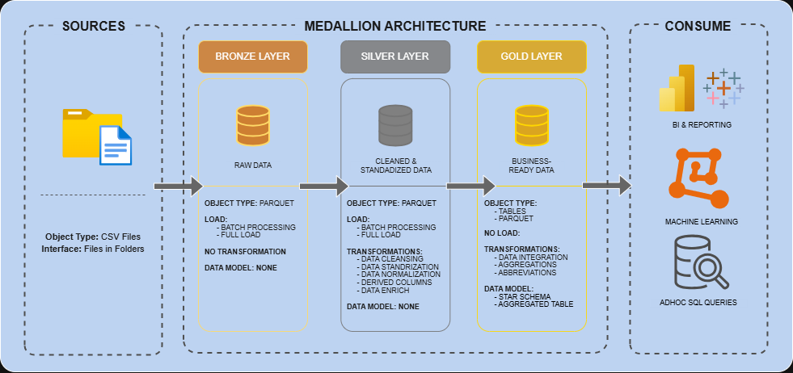
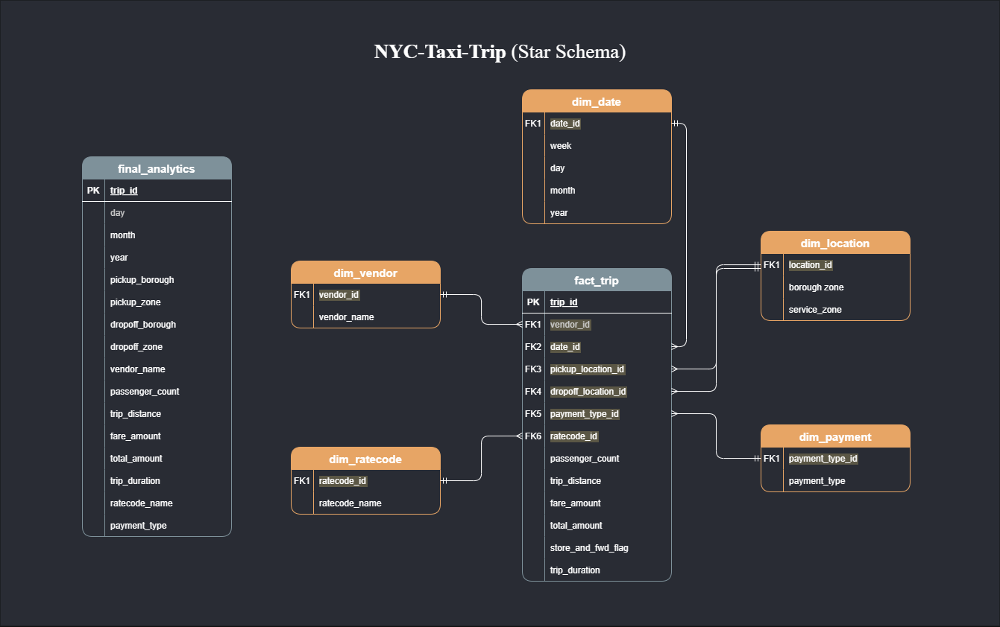
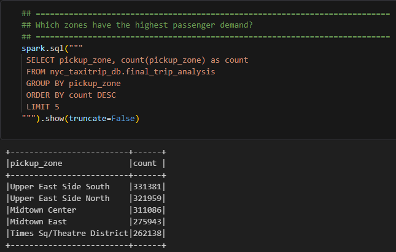
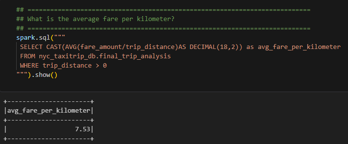

# NYC Taxi Data Engineering Pipeline

End-to-End Data Pipeline using Medallion Architecture

---

## Overview
The data architecture for this project follows Medallion Architecture. \
**Bronze** → **Silver** → **Gold** \
Raw taxi trip data is ingested, cleaned, transformed into analytical tables, \
and used to perform trip analysis and business insights.

---

## Tech Stack
**Python** – ETL pipeline development \
**Apache Spark (PySpark)** – Large-scale data processing \
**SQL** – Querying and analyzing structured data \
**Star Schema Modeling** – Dimensional data modeling for analytics \
**Git & GitHub** – Version control and collaboration \
**Visual Studio Code** – Development environment \

---

## Data Architecture


**Bronze Layer** \
Raw taxi trip data ingested from source files.

**Silver Layer** \
Cleaned and validated trip data.

**Gold Layer** \
Star schema tables optimized for analytics.

---

## Data Model


---

## Pipeline Workflow 

1. Load raw taxi data into Bronze layer
2. Clean and validate data in Silver layer
3. Create star schema tables in Gold layer
4. Run analytics queries for insights

---

## Sample Insights
- Top pickup locations \

- Average trip distance \


---

## Key Insights
- Manhattan borough Generates the Highest Revenue
- Average trip distance is around 2.8 miles
- Upper East Side South is the Popular Pickup Zone
---

### DataSet Used | NYC Taxi Trip Dataset | [Download Link](https://d37ci6vzurychx.cloudfront.net/trip-data/yellow_tripdata_2019-01.parquet)
---

## Project Structure
```
NYC-Taxi-Trip-Data-Pipeline/
│
├── configs/
|
├── datasets/
│   ├── bronze/
│   ├── silver/
│   ├── gold/
│   ├── facts_dimension/
|
├── etl/
│   ├── extract/
│   ├── transform/
│   ├── load/
│   ├── star/
│ 
├── analytics/
│   ├── final_trip_analysis/
│ 
├── notebooks/
│   ├── eda/
│ 
├── validation/
│   ├── validate/
│
├── docs/
├── pipeline.py
├── README.md
├── .gitignore
├── LICENSE
└── requirements.txt 
```
---
## Future Improvements
- Orchestrate the ETL workflow using Apache Airflow
- Deploy the pipeline on a cloud platform for scalable processing.
---
## License
This project is licensed under the [MIT License](LICENSE). You are free to use, modify, and share this project with proper attribution.